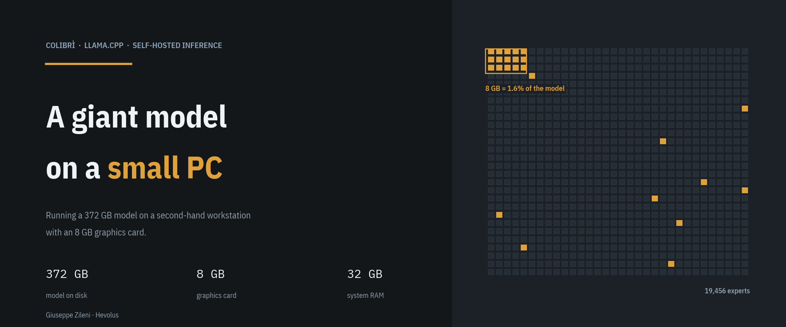
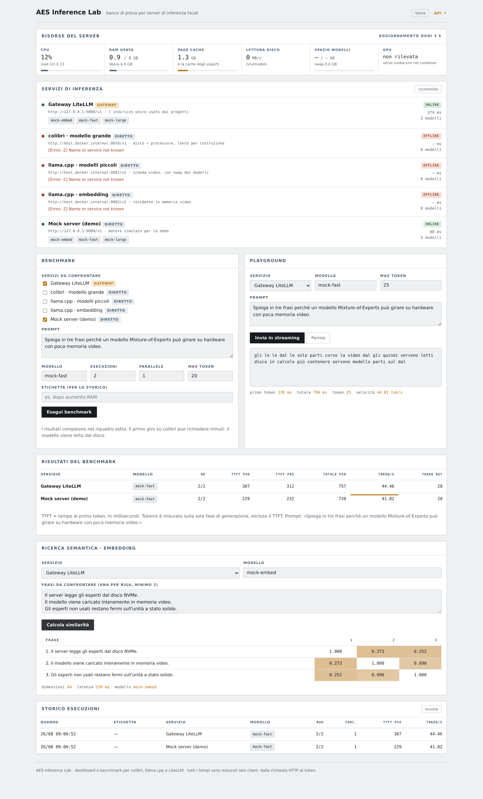

# AES Inference Lab

A test bench and dashboard for **self-hosted** inference servers: check that the
engines are alive, measure how fast they really are, try out the models, and watch
live which resource is the bottleneck.

Born for the machine described in *"A huge model on a small PC"*: a workstation with
little video memory running an enormous Mixture-of-Experts model (**colibrì**)
alongside small models on the GPU (**llama.cpp**), with a **LiteLLM** router in front.
It works, however, with any service compatible with the OpenAI API.



---

## What it does

| | |
|---|---|
| **Service status** | green/red light on every engine, call latency, list of the models actually served. Refreshes on its own. |
| **Benchmark** | time to first token (TTFT), total time, tokens per second, with p50/p95 percentiles over N runs and parallel requests. Side-by-side comparison of multiple engines on the **same** prompt. |
| **Playground** | try a prompt on an engine of your choice with a streaming response; similarity matrix for embedding models. |
| **Resource monitor** | CPU, RAM, **page cache** (the real expert cache), disk reads, model storage, VRAM and video card temperature. |
| **History** | every benchmark ends up in SQLite with a label, so you can compare *before* and *after* a change to the server. |

Every test can be run **through the gateway** or **directly against the individual
engine**: that is how you find out whether a slowdown comes from the router or from
the model, and whether a service is broken while the gateway silently covers it with
a fallback.

---

## Quick start

### Try it right now, without an inference server

The repository includes a **simulated engine** that mimics three models with very
different speeds (a very slow one like colibrì, a fast one like a small model on a
GPU, and an embedding one):

```bash
git clone https://github.com/agent-engineering-studio/aes-inference-lab.git
cd aes-inference-lab
make demo          # dashboard + simulated engine
```

Open <http://localhost:8500>.

### Against the real server

```bash
cp .env.example .env
$EDITOR .env       # addresses of your services
make up
```

If the engines are listening on `127.0.0.1` of the host machine, leave the
`host.docker.internal` addresses already in place: the compose file maps that name
onto the host.

To also see the video card (requires `nvidia-container-toolkit`):

```bash
make gpu
```

### Without Docker

```bash
make install
make dev           # http://localhost:8500
```

---

## Setting up the inference server (`setup/`)

This repository *measures* an inference server; the **`setup/`** folder *installs*
it. It contains the scripts to provision, from scratch on a dedicated machine, all
the engines the dashboard then benchmarks: **colibrì** (GLM-5.2),
**llama.cpp/llama-swap**, the **embedding server** and the **LiteLLM gateway**, plus
system and Docker tunings so they don't steal resources from inference.

```bash
cd setup
./scripts/01-autoconfig.sh   # detect the hardware and fill in .env
sudo ./install.sh 02         # preflight: verifies, changes nothing
sudo ./install.sh            # all phases, with confirmations
```

`01-autoconfig` does most of the work on its own: it detects the GPU and
`compute_cap`, decides whether the VRAM goes to the small models or to colibrì,
sizes the contexts, finds the CPUs of the right socket, computes the `docker.slice`
budget and searches Hugging Face for candidate GGUFs. The phases are independent and
re-runnable:

| Phase | What it does |
|---|---|
| `01-autoconfig` | detects the hardware and fills in `.env` (shows the diff, asks for confirmation) |
| `02-preflight` | verifies mounts, striping, quotas, GPU, RAM, ports. Does not write |
| `10-system-tuning` | sysctl, I/O scheduler, file descriptors, `wait-online` fix |
| `20-build-inference` | llama.cpp with CUDA, colibrì, llama-swap, LiteLLM venv |
| `30-fetch-models` | small GGUFs + (with confirmation) the 372 GB of GLM-5.2 |
| `40-install-services` | renders the templates, installs and starts the four units |
| `50-docker-tuning` | `daemon.json`, `docker.slice`, prune timer |
| `90-verify` | endpoints, `fio`, report in `docs/` |

It assumes the **LVM storage is already prepared**. Details, reference hardware
profile, architecture and operational notes are in
**[`setup/README.md`](setup/README.md)** and in
[`setup/docs/storage.md`](setup/docs/storage.md).

---

## Configuration

Everything lives in **`config/endpoints.yml`**. Each entry is a service compatible
with the OpenAI API; the `${VAR}` and `${VAR:-default}` variables are read from the
environment.

```yaml
endpoints:
  - id: colibri
    name: colibrì · large model
    kind: direct                # gateway | direct
    role: chat                  # chat | embedding | mixed
    base_url: ${COLIBRI_URL:-http://host.docker.internal:8070/v1}
    default_model: glm52
    note: disk + processor, slow by design
    timeout_s: 1800             # generous: the first token can take a long time
```

Setting `enabled: false` removes a service from the dashboard without deleting it.
Environment variables live in `.env` (see `.env.example`).

### Monitoring the host, not the container

The compose file mounts the host's `/proc` read-only and sets `HOST_PROC=/host/proc`.
Without this, the RAM and page cache shown would be those *of the container*, which
tell you nothing useful. The same goes for `MODELS_PATH`, mounted read-only to read
the free space where the models live.

The container is limited to 512 MB and 1 CPU: the dashboard must not steal page cache
from the inference engine, which is precisely the scarcest resource.

### Behind a reverse proxy, under a path prefix

To serve the dashboard somewhere other than the root of a domain, set the prefix in
`.env` — the app needs to know it, otherwise every link and every HTMX call points
outside the prefix:

```bash
LAB_ROOT_PATH=/inference
# the bridge gateway, i.e. the address the proxy reaches the container from;
# without it uvicorn ignores X-Forwarded-Proto and builds http:// redirects
LAB_FORWARDED_ALLOW_IPS=172.18.0.1,127.0.0.1
```

`LAB_ROOT_PATH` becomes the FastAPI `root_path`, and from there `{{ root }}` in the
templates and `document.body.dataset.root` in `app.js`. Leave it unset to serve on
the root, which is what `make dev` does.

On the nginx side `proxy_pass` must have **no trailing URI**, so the prefix reaches
the app whole — Starlette strips it from the path itself, and in exchange the
`Location` headers of redirects keep the prefix:

```nginx
location /inference {
    proxy_pass http://127.0.0.1:8500;      # no trailing slash: prefix preserved
    proxy_buffering off;                   # /api/chat/stream is SSE
    # … the usual proxy_set_header Host / X-Forwarded-* block
}
```

A ready-made vhost is in `setup/etc/nginx/office-gdc`; its header comments carry the
install commands. Note that `sites-enabled/` must hold a **symlink**: a plain copy
freezes the config at the moment it was made, and later edits to `sites-available/`
silently never take effect.

---

## Command line

Same logic as the dashboard, without a browser — useful over SSH or in a script.

```bash
# list the configured endpoints
python -m cli.bench --list

# compare two engines, 5 runs each
python -m cli.bench --endpoint colibri --endpoint llama_chat --runs 5

# measure the gateway cost relative to the direct engine
python -m cli.bench --endpoint gateway --endpoint llama_chat --model qwen3-4b --runs 10

# JSON for further processing
python -m cli.bench --endpoint gateway --json > run.json
```

```
SERVICE                   MODEL                      OK   TTFT p50   TOT p50    TOK/S
--------------------------------------------------------------------------------
llama.cpp · small models  qwen3-4b                  5/5        184      3 120    41.28
colibrì · large model     glm52                     5/5    412 900    986 400     1.31
```

---

## API

The dashboard is just a face: underneath there is a JSON API documented at `/docs`.

| Method | Route | What it does |
|---|---|---|
| `GET` | `/api/health` | status and models of every endpoint |
| `GET` | `/api/resources` | CPU, RAM, page cache, disk, GPU |
| `POST` | `/api/bench` | runs a benchmark and saves it |
| `GET` | `/api/history` | history of the runs |
| `DELETE` | `/api/history` | clears the history |
| `POST` | `/api/chat/stream` | streaming chat (SSE) |
| `POST` | `/api/embed` | embeddings + cosine similarity matrix |

```bash
curl -s localhost:8500/api/bench -H 'content-type: application/json' -d '{
  "endpoints": ["gateway", "colibri"],
  "runs": 3, "max_tokens": 128, "label": "after RAM upgrade"
}' | jq '.[] | {endpoint, tokens_per_s_mean, ttft_ms_p50}'
```

---

## How to read the numbers

- **TTFT** (time to first token) is the delay before the first word arrives. On
  colibrì it can be minutes: the model is read from disk. It is the metric that
  decides whether an engine is usable interactively.
- **Tokens/s** is computed on the generation phase only, excluding the TTFT. It is
  meant to estimate how long a long piece of text takes.
- **p95** over few runs is not serious statistics: it is there to show whether there
  is variability, not to certify a value.
- Times are measured **client-side**, from the HTTP request to the token. They
  therefore include the network and the router: it is what a project actually
  experiences.
- Always compare **gateway** and **direct** on the same model: the difference is the
  router's cost.

A tip from experience: if you have configured a fallback to a paid service,
**disable it while testing**. With the fallback active, a broken local engine is
silently covered and the numbers you read are not its own.

---

## Structure

```
app/
  main.py         FastAPI application
  config.py       reads config/endpoints.yml, expands ${VAR}
  clients.py      OpenAI-compatible client: models, chat SSE, embeddings
  bench.py        benchmark engine, percentiles
  health.py       service status, automatic model selection
  metrics.py      CPU, RAM, page cache, disk, GPU via nvidia-smi
  storage.py      history in SQLite
  routers/        api.py (JSON) and ui.py (HTML + HTMX)
  templates/      dashboard, partials updated by HTMX
  static/         CSS, JS, htmx (no external resources: works offline)
cli/bench.py      command-line benchmark
mock/server.py    simulated inference engine for demo and tests
tests/            14 tests on client, benchmark and API
setup/            provisioning of the inference server (see setup/README.md)
  install.sh      phase orchestrator
  scripts/        the phases 01→90 (autoconfig, preflight, build, services…)
  etc/            configuration templates (litellm, llama-swap, nginx, systemd…)
  lib/            shared functions for the scripts
  bench/          low-level A/B (DIRECT=1, page cache)
  docs/           storage.md and generated reports
```

No dependency on any CDN: the dashboard works on a machine with no internet access,
which is the typical case for an on-premise inference server.

---

## Development

```bash
make install    # virtualenv + dependencies
make test       # pytest
make lint       # ruff
make mock       # simulated engine on port 9000
```

The tests do not require an inference server: they use the simulated engine started
in a thread.

---

## License

MIT — see [LICENSE](LICENSE).
